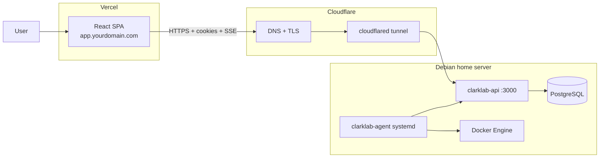

# Production deployment

Deploy the React dashboard on **Vercel** (`app.yourdomain.com`) and run **PostgreSQL**, the **API**, and the **agent** on a headless **Debian** home server. Expose the API at `api.yourdomain.com` through a **Cloudflare Tunnel** (no port forwarding).

Replace `yourdomain.com` with your real domain everywhere below.

## Architecture



Auth uses HttpOnly cookies on `api.yourdomain.com` with `Domain=.yourdomain.com`, so the Vercel app on `app.yourdomain.com` shares the same registrable domain. See README **Production auth**.

---

## 1. Prerequisites

| Item | Notes |
|------|--------|
| Domain on Cloudflare | DNS for tunnel + Vercel CNAME |
| Vercel account | Linked to this Git repository |
| Debian + Docker Engine | `docker compose` v2 |
| Agent host tools | `git`, `curl`, Rust (`rustup`), Docker; `install.sh` adds `nixpacks` |

Generate secrets locally (never commit):

```bash
openssl rand -hex 32   # JWT_SECRET
openssl rand -hex 32   # INTEGRATION_ENCRYPTION_KEY (must differ from JWT_SECRET)
openssl rand -hex 16   # SIGNUP_ACCESS_CODE
openssl rand -hex 24   # POSTGRES_PASSWORD
```

---

## 2. Cloudflare Tunnel (API)

On the Debian server:

```bash
git clone <your-repo-url> /opt/clarklab
cd /opt/clarklab
chmod +x scripts/setup-cloudflared-tunnel.sh
sudo scripts/setup-cloudflared-tunnel.sh clarklab-api api.yourdomain.com
```

This script installs `cloudflared`, creates the tunnel, writes [`deploy/cloudflared/config.yml.example`](deploy/cloudflared/config.yml.example) to `/etc/cloudflared/config.yml`, routes DNS, and enables the [`clarklab-tunnel`](deploy/cloudflared/clarklab-tunnel.service) systemd unit.

Manual alternative: copy [`deploy/cloudflared/config.yml.example`](deploy/cloudflared/config.yml.example), replace tunnel UUID and hostname, then `systemctl enable --now clarklab-tunnel`.

The API container binds to `127.0.0.1:3000` only ([`docker-compose.prod.yml`](docker-compose.prod.yml)), so only `cloudflared` can reach it from outside Docker.

---

## 3. API + PostgreSQL on Debian

```bash
cd /opt/clarklab
cp .env.production.example .env
# Edit .env: secrets, yourdomain.com, GitHub OAuth values
docker compose -f docker-compose.prod.yml build api
docker compose -f docker-compose.prod.yml up -d
```

Verify:

```bash
curl https://api.yourdomain.com/health
```

Migrations run on API startup. Schedule backups:

```bash
chmod +x scripts/backup-postgres.sh
./scripts/backup-postgres.sh
```

---

## 4. Vercel frontend

Import the repository in Vercel. [`vercel.json`](vercel.json) at the repo root sets:

| Setting | Value |
|---------|--------|
| Install | `npm ci` |
| Build | `npm run build -w clarklab-frontend` |
| Output | `clarklab-frontend/dist` |
| Rewrites | SPA fallback to `index.html` |

**Environment variables** (Project → Settings → Environment Variables, **Production**):

```env
VITE_API_URL=https://api.yourdomain.com
VITE_USE_MOCK=false
VITE_CLARKLAB_SERVER_URL=https://api.yourdomain.com
VITE_CLARKLAB_AGENT_INSTALL_URL=https://api.yourdomain.com/agent/install.sh
VITE_GITHUB_CLIENT_ID=<oauth-app-client-id>
VITE_GITHUB_OAUTH_REDIRECT_URI=https://app.yourdomain.com/dashboard/settings
```

Add custom domain `app.yourdomain.com` in Vercel. In Cloudflare DNS, CNAME `app` → Vercel’s target (`cname.vercel-dns.com`).

Do **not** put `JWT_SECRET`, `GITHUB_CLIENT_SECRET`, or other API secrets in Vercel.

---

## 5. GitHub OAuth

Create a **GitHub OAuth App** (Settings → Developer settings → OAuth Apps):

| Field | Value |
|-------|--------|
| Homepage URL | `https://app.yourdomain.com` |
| Authorization callback URL | `https://app.yourdomain.com/dashboard/settings` |

Set on the **API** (`.env` on the server):

```env
GITHUB_CLIENT_ID=...
GITHUB_CLIENT_SECRET=...
GITHUB_OAUTH_CALLBACK_URL=https://app.yourdomain.com/dashboard/settings
```

Set `VITE_GITHUB_CLIENT_ID` to the same client ID on Vercel.

---

## 6. Agent install

On each node (can be the same Debian box as the API):

1. Dashboard → **Add node** → copy registration token.
2. As root:

```bash
curl -fsSL https://api.yourdomain.com/agent/install.sh | sudo bash -s -- \
  --token <registration-token> \
  --server https://api.yourdomain.com
```

3. Confirm: `systemctl status clarklab-agent`

First install compiles the agent from source (~5–10 min). Requires Rust on the node.

---

## 7. Production smoke test

From any machine with network access:

```bash
chmod +x scripts/smoke-test-production.sh
API_URL=https://api.yourdomain.com \
APP_URL=https://app.yourdomain.com \
SIGNUP_ACCESS_CODE=<your-code> \
./scripts/smoke-test-production.sh
```

Manual checklist:

1. `curl https://api.yourdomain.com/health` → `{"status":"ok",...}`
2. Open `https://app.yourdomain.com` → landing page
3. Sign up with access code → first user is sysadmin
4. Dashboard loads (cookie auth)
5. Service or agent log stream connects (SSE)
6. Node shows online after agent install
7. Deploy a test service
8. GitHub OAuth under Settings → Integrations
9. Logout revokes session

---

## Environment matrix

| Variable | Where | Purpose |
|----------|--------|---------|
| `NODE_ENV=production` | API `.env` | Secret validation, secure cookies |
| `POSTGRES_PASSWORD` | API `.env` | Postgres + `DATABASE_URL` |
| `JWT_SECRET`, `INTEGRATION_ENCRYPTION_KEY`, `SIGNUP_ACCESS_CODE` | API `.env` | Auth and encryption |
| `CORS_ORIGIN`, `COOKIE_DOMAIN`, `COOKIE_SECURE` | API `.env` | Cross-subdomain cookies |
| `CLARKLAB_SERVER_URL`, `CLARKLAB_AGENT_INSTALL_URL` | API `.env` | Agent and install URLs |
| `GITHUB_*` | API `.env` | OAuth token exchange |
| `VITE_*` | Vercel build | Browser API URL and OAuth redirect |

Template: [`.env.production.example`](.env.production.example)

---

## Security notes

- Keep Postgres off the public internet (`docker-compose.prod.yml` has no `5432` publish).
- API listens on `127.0.0.1:3000` only; Cloudflare Tunnel terminates TLS.
- Agent hosts are high-trust (Docker socket). Use dedicated `clarklab` user from `install.sh`.
- Rotate secrets if `.env` is ever exposed.
